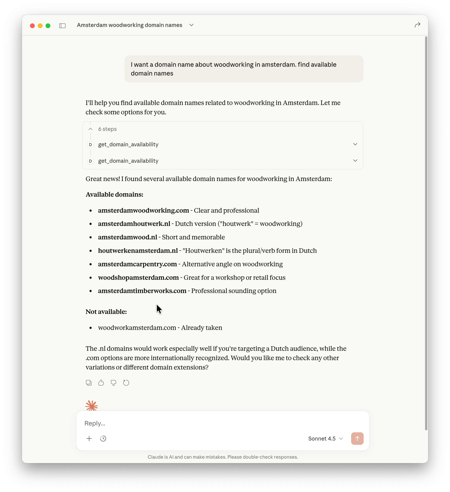

# domain-mcp
MCP for checking domain name availability

Add domain check functionality to your AI agent and use it to
find available domain names for your next website/project.

```json
{
  "mcpServers": {
    "domaincheck": {
      "command": "node",
      "args": ["<YOURPATH>/domain-mcp/build/index.js"]
    }
  }
}
```

Example of use in Claude:

